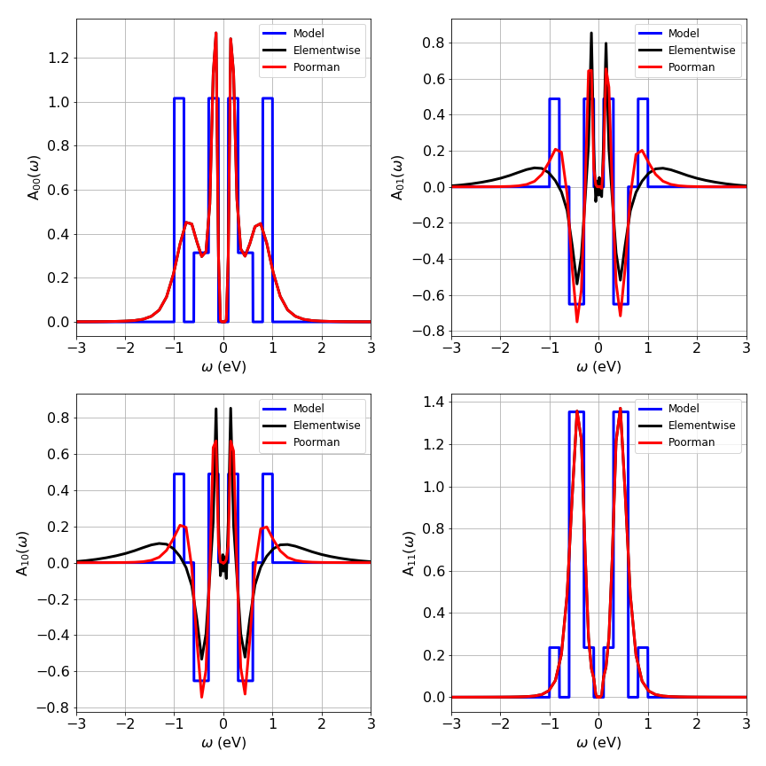

.. _elementwise:

Continuation of matrix-valued functions [#maxent]_
=====================================================

In principle one can perform the analytic continuation separately for each matrix element,
using the conventional entropy for diagonal elements and the modified entropy for the off-diagonals.
We term this way of dealing with matrix-valued Green function :py:class:`.ElementwiseMaxEnt`.

Using, e.g., a flat default model for each element reflects the total absence of previous knowledge
on the problem. However, we know that a necessary condition for the positive semi-definiteness of
the resulting spectral function matrix is

.. math::

        | A_{ll'} | \leq \sqrt{A_{ll} A_{l'l'}}.
        \label{eq:condition-posdef}

For example, for a problem where all diagonal elements of the spectral function are zero at a
certain frequency :math:`\omega`, this condition implies that also all off-diagonal elements have
to be zero at this :math:`\omega`. Thus, once the diagonal elements have been analytically continued,
this condition constitutes additional knowledge about the problem which can be incorporated by choosing
a default model for the off-diagonal elements :math:`D_{ll'}(\omega)` accordingly,

.. math::
        D_{ll'}(\omega) = \sqrt{A_{ll}(\omega)A_{l'l'}(\omega)}+\epsilon.
        \label{eq:poor-man-default}

Here, :math:`\epsilon` is a small number to prevent the default model from becoming zero, so that no
division by zero occurs in the entropy term. We call this approach :py:class:`.PoormanMaxEnt`.

The example below shows the continuation of 2x2 model Green function. The special choice of
the default model does indeed improve the results of the off-diagonal elements.
However, for physical systems, the resulting spectral function matrix has to be positive semi-definite
and Hermitian, which is usually not the case when the analytic continuation is carried out separately
for each matrix element. Using the Poorman scheme usually improves the solution, but the only way
to ensure that the obtained spectral function is indeed positive semi-definite and Hermitian is by
treating the spectral function matrix as a whole. We plan to make the **FullMatrixMaxEnt**
public in the future.

.. rubric:: Example

An example for a 2x2 matrix:

.. literalinclude:: elementwise/elementwise_example.py
   :language: python
   :linenos:

.. note::

        This model with very sharp edges is a complicated case for the Maximum Entropy method; it tends to smoothen them out considerably.
        However, the obtained curves show roughly the quality of the results that can be obtained with MaxEnt.
        After all, the analytic continuation is an ill-posed problem. For a given :math:`G(\tau)` (with noise) one can find
        infinitely many :math:`A(\omega)` to satisfy the data within the given error bars.
        The comparision of the original (sharp) spectral function to the MaxEnt :math:`A(\omega)` demonstrates the accuracy
        of analytic continuations:
        The overall structure and features are reproduced, but details are smeard out (especially at higher frequencies).
        In any case, one **cannot** expect that :math:`A_i(\omega)\to G(\tau) \to A_c(\omega`) results in
        :math:`A_i(\omega) = A_c(\omega)`.

.. rubric:: Footnotes

.. [#maxent] `G. J. Kraberger, R. Triebl, M. Zingl and M. Aichhorn, Phys. Rev. B 96, 155128 (2017) <https://link.aps.org/doi/10.1103/PhysRevB.96.155128>`_

