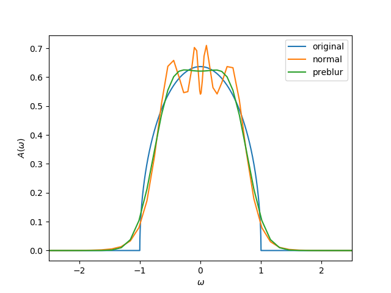

.. _preblur:

Continuation of metallic solutions using preblur
================================================

The MaxEnt formalism has the tendency of producing spurious noise around the :math:`\omega=0` point.
This is usually not problematic for insulating solutions, but not desirable for metallic spectral functions.

One strategy to tackle this is the so-called preblur technique [#f1]_.
There, a so-called *hidden image* :math:`H` is introduced, with the spectral function being :math:`A = B H` [#f2]_.
The matrix :math:`B` is the blur matrix; multiplying by :math:`B` is equal to a convolution with a Gaussian (its width :math:`b` is an external parameter).
Then, in the cost function, both :math:`H` and :math:`A` are used,

.. math::

    Q_{\alpha}(v) = \frac12 \chi^2(A(H(v))) - \alpha S(H(v)).

The parametrization :math:`H(v)` is, e.g., Bryan's parametrization, :math:`H(v) = D e^{Vv}`.
The parametrization :math:`A(H)` is, of course, :math:`A = B H`.

The class :py:class:`~.MaxEntCostFunction` accepts a parameter ``A_of_H``.
Only two different parametrizations for :math:`A(H)` are implemented: the :py:class:`~.functions.IdentityA_of_H` and :py:class:`~.functions.PreblurA_of_H` variants.
The former just chooses the usual :math:`A(H) = H`, the latter uses :math:`A(H) = BH` as discussed here.

Note that, for performance reasons, the kernel has to be redefined to include the blur matrix. This is done by choosing the :py:class:`.PreblurKernel`.

The calculation should be performed using different values for :math:`b`.
The best value of :math:`b` can be determined similarly to determining :math:`\alpha`; e.g., by calculating the probability of every :math:`b` or by looking at :math:`\log(\chi^2)` of :math:`\log b`.

.. rubric:: Example

A full example:

.. literalinclude:: preblur_example.py
   :language: python
   :linenos:

.. rubric:: Footnotes

.. [#f1] J\. Skilling, Fundamentals of MaxEnt in data analysis, in Maximum Entropy in Action, edited by B.Buck and V.A. Macaulay (Clarendon Press, Oxford, UK, 1991), p. 19.
.. [#f2] As a slight complication, for non-uniform :math:`\omega` meshes, we have :math:`A = B H /\Delta \omega` and :math:`G_{rec} = K \Delta \omega B H`, where :math:`H` contains a :math:`\Delta\omega` (i.e. the hidden image itself would be :math:`H/\Delta\omega`).
