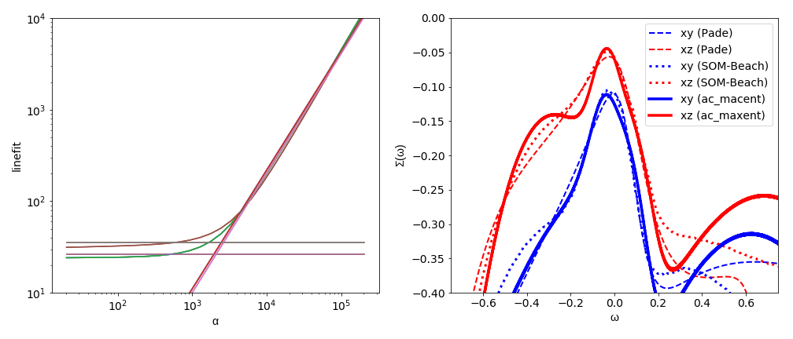

.. _sigma_continuator:

Continuation of self-energies: Sr\ :sub:`2`\RuO\ :sub:`4`
=========================================================

A central quantity of many-body theory is the self-energy :math:`\Sigma`.
Often it is beneficial to perform the analytic continuation for the self-energy instead
of the Green function. Different ways to continue self-energies exist (see Ref. [#maxent]_),
but the most commonly used approach is to continue an auxiliary quantity :math:`G_{aux}(\omega)`.
This requires the following five steps:

        * construction of :math:`G_{aux}(i\omega_n)` from the self-energy :math:`\Sigma(i\omega_n)`,
        * inverse Fourier transform to :math:`G_{aux}(\tau)`
        * analytic continuation of :math:`G_{aux}(\tau)` to :math:`A_{aux}(\omega)`,
        * construction of :math:`G_{aux}(\omega+i0^+)` from :math:`A_{aux}(\omega)`,
        * and calculating :math:`\Sigma(\omega+i0^+)` from :math:`G_{aux}(\omega+i0^+)`.

Beside the analytic continuation itself the above steps are carried out by the :py:class:`.SigmaContinuator`.
This tool has two possible constructions of :math:`G_{aux}` implemented:

        * :py:class:`.DirectSigmaContinuator`:
          :math:`G_{aux}(z) = \Sigma(z) - \Sigma(i\infty)`
          where :math:`\Sigma(i\infty)` is the constant term of the high-frequency expansion of :math:`\Sigma(i\omega_n)`.
          For matrix-valued Green functions the resulting quantity :math:`G_{aux}` would not obey the correct analytic
          high-frequency behavior. Therefore, the :py:class:`.DirectSigmaContinuator` is only implemented for the diagonal
          problems.
        * :py:class:`.InversionSigmaContinuator`:
          :math:`G_{aux}(z) = (z + C - \Sigma(z))^{-1}`
          The constant :math:`C` is a free parameter, but is usually set to :math:`C= \Sigma(i\infty) + \mu`
          with the chemical potential :math:`\mu` in DMFT calculations.

Note that an error propagation from :math:`\Sigma(i\omega_n)` to :math:`G_{aux}(\tau)` is currently not
implemented in the :py:class:`.SigmaContinuator`.

The :py:class:`.SigmaContinuator` does accept TRIQS Green functions, but can be also used directly with
TRIQS BlockGFs. How this is used in practise is shown in the example below.

.. rubric:: Example

In the example below we continue the t\ :sub:`2g` self-energy of Sr\ :sub:`2`\RuO\ :sub:`4`
with the InversionSigmaContinuator. The self-energy is the result of a
DFT+DMFT calculation performed at an inverse temperature :math:`\beta = 37.5~1/eV`
(:download:`h5-file<sro/Sr2RuO4_b37.h5>`).

After loading the self-energy we initialize the :py:class:`.InversionSigmaContinuator`
``isc`` with the constant shift ``C`` set to the double counting (``dc``). The
:py:class:`.SigmaContinuator` directly takes a TRIQS Block Green function and calculates
the auxiliary Green function :math:`G_{aux}(i\omega_n)`. We need to run six
analytic continuations (for each block individually) by looping over all orbitals/spins
of ``isc.Gaux_iw``. In principle it would be sufficient to perform two continuations,
because the t\ :sub:`2g`\ -subspace consists of the *xy* and the degenerate *xz/yz* orbitals.
Note that the self-energy in the h5-file is already symmetrized. We collect the results
in the dict ``res`` and save it to the h5-file. Additionally, we save the :py:class:`.SigmaContinuator`.

.. literalinclude:: sro/sigma_continuator_SRO_1.py
   :language: python
   :linenos:

In the second part of this example, we load the results of the first part and reconstruct
a real-frequency self-energy from the auxiliary spectral function :math:`A_{aux}(\omega)`.
First we store the resulting spectral function of the :py:class:`.LineFitAnalyzer` in a
dictionary. The :py:class:`.SigmaContinuator` provides the method :py:meth:`.set_Gaux_w_from_Aaux_w`,
which calls the function :py:func:`.get_G_w_from_A_w` to obtain the real-part of :math:`G_{aux}(\omega)`
with Kramers-Kronig. Additionally, :py:meth:`.set_Gaux_w` is called automatically to reconstruct
a real-frequency self-energy from :math:`G_{aux}(\omega)`. We use ``np_interp_A=10000`` to interpolate
the spectral function on a denser linear grid with :math:`10000` points between ``omega_min``
and ``omega_max``. The auxiliary Green function is then calculated on a linear grid
between :math:`-1\ \mathrm{eV}` and :math:`1\ \mathrm{eV}` with :math:`4000` points (``np_omega``) and
the resulting self-energy is accessible with ``isc.S_w``.

.. literalinclude:: sro/sigma_continuator_SRO_2.py
   :language: python
   :linenos:

The left graph shows the :math:`\chi^2` versus :math:`\alpha` curve for all orbitals and spins.
Due to the degeneracies we only observe two lines (and their linefits) - one for the *xy* and one
for the xz/yz orbitals - both of them show the characteristic kink.

In the right graph the imaginary part of the resulting self-energies are shown and compared to Padé
and the Stochastic Optimization Method (SOM) by Beach [#beach]_. At low energies all methods agree
reasonably well. The analysis of the self-energies shows that the *xy* orbitals are considerably
"more incoherent" in Sr\ :sub:`2`\RuO\ :sub:`4`; the self-energy at zero :math:`\Sigma(\omega = 0)`
is about a factor of :math:`2` larger for the *xy* orbitals.

.. rubric:: Footnotes

.. [#maxent] `G. J. Kraberger, R. Triebl, M. Zingl and M. Aichhorn, Phys. Rev. B 96, 155128 (2017) <https://link.aps.org/doi/10.1103/PhysRevB.96.155128>`_

.. [#beach] `K. S. D. Beach, arXiv:cond-mat/0403055 <https://arxiv.org/abs/cond-mat/0403055>`_
