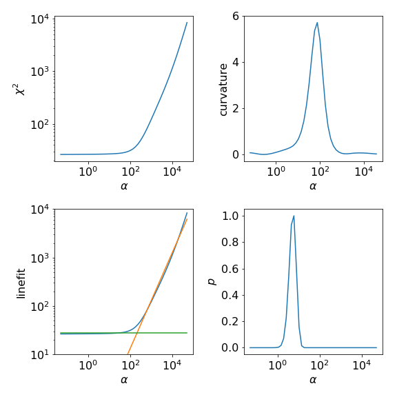
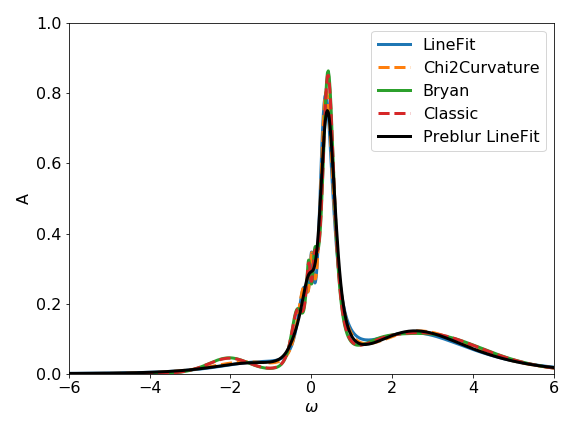

Real-material application: SrVO\ :sub:`3`
=========================================

In this example we perform an analytic continuation
for an impurity :math:`G(\tau)` calculated from DFT+DMFT for the
t\ :sub:`2g` subspace of paramagnetic SrVO\ :sub:`3`. All three t\ :sub:`2g` orbitals are
degenerate, thus we have to perform the continuation only for
one orbital. The DFT+DMFT solution itself can be obtained with the
TRIQS/dft_tools package and we like to refer the interested
user to the `corresponding user guide page <https://triqs.github.io/dft_tools/master/guide/SrVO3.html>`_ on SrVO\ :sub:`3`.
However, for this example we directly provide the :math:`G(\tau)`
at :math:`\beta = 37.5~1/eV` as a downloadable :download:`file<srvo3/srvo3_G_tau.dat>`.
For simplicity we use a constant error of :math:`10^{-3}` for all :math:`\tau` points.

Running TauMaxEnt
-----------------

.. literalinclude:: srvo3/srvo3_run.py
   :language: python
   :linenos:

Analyzing the result
--------------------

In the following we plot :math:`\chi^2(\alpha)` and the corresponding
curvature as well as the result of the linefit.
The :py:class:`.LineFitAnalyzer` uses as optimal :math:`\alpha` value the intersection of the
two fitted lines. The :py:class:`.Chi2CurvatureAnalyzer` uses the :math:`\alpha` at the maximum
curvature of :math:`\chi^2(\alpha)`. Further we enabled in this example
the calculation of the probability for each :math:`\alpha`.
Then, the :py:class:`.ClassicAnalyzer` takes the :math:`\alpha` at the maximum of the probability and
the :py:class:`.BryanAnalyzer` averages over all spectral functions weighted by the corresponding
probabilities.

Usually the results of the :py:class:`.LineFitAnalyzer` and the :py:class:`.Chi2CurvatureAnalyzer` are similar.
Also, as the probability is often sharply peaked at an :math:`\alpha` value the :py:class:`.ClassicAnalyzer`
and :py:class:`.BryanAnalyzer` give similar spectral functions.

.. literalinclude:: srvo3/srvo3_analysis.py
   :language: python
   :linenos:

Note that the :py:class:`.LineFitAnalyzer` and the :py:class:`.Chi2CurvatureAnalyzer` are less sensitive to the
given error, and thus work also well when the real error is not known.
On the other hand, the analyzers based on the probability depend on the given error.
As an exercise try to set the error to a different value, e.g.:

.. code-block:: python

        tm.error(1e-4)

and compare the result spectral functions of the different analyzers.
You might need to adjust also the :math:`\alpha`-grid.
If the error is, e.g., scaled by a factor of 10, the :math:`\alpha`
range should be changed by a factor of 100.

Visualization in notebook
-------------------------

Above we have used the plot_* method, which is implemented for many objects,
to visualize the output. However, the data can be also visualized with
the interactive Jupyter widget `JupyterPlotMaxEnt`:

.. code-block:: python

        from triqs_maxent.plot.jupyter_plot_maxent import JupyterPlotMaxEnt
        JupyterPlotMaxEnt(res)

For further ways to visualize your results have a look at the :ref:`Visualization<visualization>` page.

Saving the data to a h5-file
----------------------------

The data of the MaxEnt run (:py:class:`.MaxEntResult`) can be stored as :py:class:`.MaxEntResultData`
object to a h5-file with:

.. code-block:: python

        from h5 import *
        with HDFArchive('srvo3_maxent.h5','w') as ar:
            ar['maxent_result'] = res.data
            ar['maxent_result_pb'] = res_pb.data
