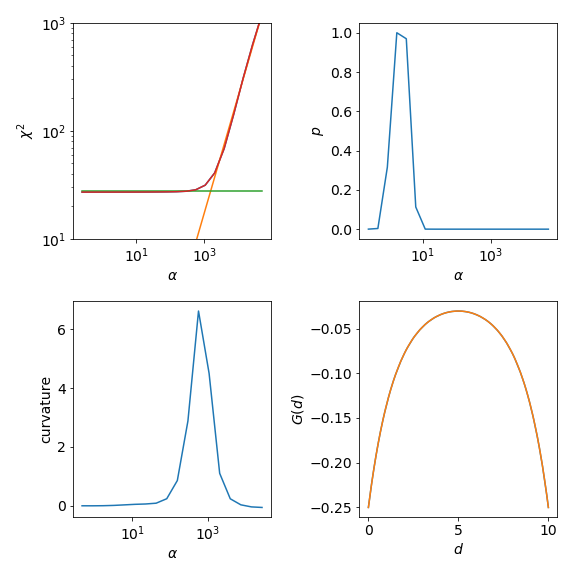
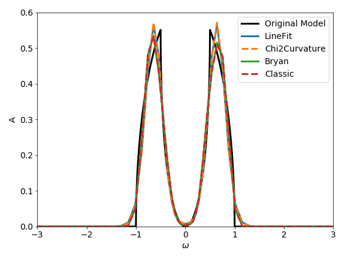

Continuation of a 1x1 Green Function
====================================

For continuing a single diagonal element of a Green function,
the :py:class:`~.tau_maxent.TauMaxEnt` class is the right tool.
The Green function can be given as
:py:class:`~triqslibs:triqs.gf.GfImTime` (use
:py:meth:`~.tau_maxent.TauMaxEnt.set_G_tau`) or as :py:class:`~triqslibs:triqs.gf.GfImFreq`
(use :py:meth:`~.tau_maxent.TauMaxEnt.set_G_iw`). Additionally, it is possible to set
:math:`G(\tau)` directly with a data array (:py:meth:`~.tau_maxent.TauMaxEnt.set_G_tau_data`) or
load it from a file (:py:meth:`~.tau_maxent.TauMaxEnt.set_G_tau_file`).

Creation of a mock :math:`G(\tau)`
----------------------------------

For the following guide, we will assume that you have a TRIQS
``GfImTime`` ready; if you have not, you can produce one, for
example an insulating mock :math:`G(\tau)`, using

.. code-block:: python

    #TRIQS 2.1
    from triqs.gf import *
    #TRIQS 1.4
    from triqs.gf.local import *
    import numpy as np

    err = 1.e-5
    G_iw = GfImFreq(beta=10, indices=[0])
    G_w = GfReFreq(window=(-10, 10), indices=[0])
    G_iw << SemiCircular(1)-0.5*SemiCircular(0.5)
    G_w << SemiCircular(1)-0.5*SemiCircular(0.5)
    G_tau = GfImTime(beta=10, indices=[0], n_points=2501)
    G_tau.set_from_fourier(G_iw)
    G_tau.data[:, 0, 0] += err * np.random.randn(len(G_tau.data))

Here, we added random Gaussian noise to the :math:`G(\tau)`.
From experience, we know that the MaxEnt algorithm does not work
well with exact data, we thus have to have some kind of noise on
the data.

Setting up and running TauMaxEnt
--------------------------------

The class to analytically continue a :math:`G(\tau)`
is the :py:class:`~.tau_maxent.TauMaxEnt` class.
It sets up everything we need; but internally, the work is
done by the :py:class:`~.maxent_loop.MaxEntLoop` class.

In MaxEnt, we minimize the functional (cost function)

.. math::

    Q[A; \alpha] = \frac12 \chi^2[A, G(\tau), \sigma] - \alpha S[A, D].

The ingredients are the spectral function :math:`A`, the data :math:`G(\tau)`,
the error :math:`\sigma`, the default model :math:`D` and the hyper-parameter
:math:`\alpha`.

This cost function is represented by the :py:class:`~.CostFunction` class.
There are two different versions of the MaxEnt cost function available, one
very general one, the :py:class:`~.MaxEntCostFunction`, and one
version with some optimizations for the one-orbital case [#f1]_, which is called
:py:class:`~.BryanCostFunction` [#f2]_.
Here, the latter is the right choice.

The :py:class:`~.MaxEntCostFunction` is used by default, but we can tell the :py:class:`~.tau_maxent.TauMaxEnt`
class to use the :py:class:`~.BryanCostFunction` with ``TauMaxEnt(cost_function=BryanCostFunction())``
or ``TauMaxEnt(cost_function='bryan')`` in its constructor.

We then have to set the data :math:`G(\tau)`. As we have a TRIQS ``GfImTime`` we do this
with :py:meth:`~.tau_maxent.TauMaxEnt.set_G_tau`
Furthermore, we have to set the error :math:`\sigma`.
If you have a covariance matrix available you can set it with :py:meth:`~.tau_maxent.TauMaxEnt.set_cov`.
In our case, we just added random noise to :math:`G(\tau)`, thus we can use the
method :py:meth:`~.tau_maxent.TauMaxEnt.set_error`. Note that a :math:`\tau`
dependent error is possible by passing a vector.

The default model is chosen to be flat by default.
The hyper-parameter :math:`\alpha` will be varied in a loop; for many
cases, the default setting should be okay (see below for adjusting the
:math:`\alpha` range).

Note that the calculation of probabilities is not enabled by default.
You can achieve this by setting ``TauMaxEnt(probability=NormalLogProbability())`` or
``TauMaxEnt(probability='normal')`` (see also :ref:`Probabilities<probabilitiesref>`).

Then, the MaxEnt procedure can be started using :py:meth:`~.maxent_loop.MaxEntLoop.run`.
It returns the result as a :py:class:`~.maxent_result.MaxEntResult` object.

.. code-block:: python

    from triqs_maxent import *

    tm = TauMaxEnt(cost_function='bryan', probability='normal')
    tm.set_G_tau(G_tau)
    tm.set_error(10*err)
    result = tm.run()

Here, we used ``tm.set_error(10*err)`` as given error - we will
come back to this in the discussion of the results.

If you set ``tm.interactive`` to ``True`` (the default value),
by pressing ``Ctrl+C``, you can choose from several different options
how to proceed, e.g., just aborting the minimization of the current :math:`\alpha`, aborting
the :math:`\alpha` loop, or exiting right away.

Finally, we save the result to a h5-file with

.. code-block:: python

    from h5 import HDFArchive

    with HDFArchive('file_name.h5','w') as ar:
        ar['maxent'] = result.data

Changing some of the parameters
-------------------------------

The :math:`\alpha` mesh can be changed with ``tm.alpha_mesh``; an example would be

.. code-block:: python

    tm.alpha_mesh = LogAlphaMesh(alpha_min=0.01, alpha_max=2000, n_points=60)

Often, it can be useful to adjust the :math:`\omega` mesh (see :ref:`omega meshes<omegameshes>`).
It can be set, e.g., using

.. code-block:: python

    tm.omega = HyperbolicOmegaMesh(omega_min=-10, omega_max=10, n_points=101)

The default model can be changed by assigning it to ``tm.D``.

Choosing the value of the hyper-parameter
-----------------------------------------

There are several methods to choose the **final** spectral function given all the spectral
functions that minimize the cost function ``Q`` for the different values of :math:`\alpha`
(see also :ref:`Ways to choose alpha<maxent-flavors>`).

In the code, this is done using so-called *analyzers* (see :ref:`Analyzer<analyzerref>`).
The variable ``tm.analyzers`` contains a list of analyzer class instances; the result
is analyzed with each of them. By default, the :py:class:`.LineFitAnalyzer`,
the :py:class:`.Chi2CurvatureAnalyzer` and the :py:class:`.EntropyAnalyzer` are used.
Should you have enabled the probabilities, the :py:class:`.BryanAnalyzer` and the
:py:class:`.ClassicAnalyzer` are added automatically.

Note that the :py:class:`.LineFitAnalyzer` and the :py:class:`.Chi2CurvatureAnalyzer`, which
are based on the analysis of the function :math:`\log(\chi^2)` versus :math:`\log(\alpha)`,
are not very sensitive to the given error (if constant), as scaling the error will just result
in a shift of the chosen :math:`\alpha`. On the other hand, the chosen :math:`\alpha` in the
probabilistic methods depends strongly on the given error. This is the reason why we scaled the
given error by a factor of 10 for the example above, as otherwise it would result in a severe
over-fitting of the data (too small :math:`\alpha`), see also [#r1]_ [#r2]_.

Let's turn back to the output of the analyzers. Each analyzer produces one single spectral
function, which can be accessed, e.g. for the ``LineFitAnalyzer``, as

.. code-block:: python

    result.get_A_out('LineFitAnalyzer')

As the ``LineFitAnalyzer`` is the default, it is also possible to
just use ``result.A_out`` or ``result.get_A_out()``.

Some important information on the performance of the analyzer is
available as well; it can be found by getting the analyzer result
as::

    result.analyzer_results['LineFitAnalyzer'][attribute]

where attribute can be, e.g., ``'A_out'`` (the same as above).
In addition to the attribute ``A_out``,
the :py:class:`.AnalyzerResult`
also contains a ``name`` (which is also how it is addressed in
``result.analyzer_results``), an ``info`` field containing human-readable
information about which :math:`\alpha` the analyzer chooses, and some analyzer-dependent
fields.

Visualizing and checking the results
------------------------------------

For a summary of visualization tools see the :ref:`Visualization<visualization>` page.

The following script and the figures show the most important things you should look at
after your MaxEnt run (however, in practice it might be easier to just use ``plot_maxent`` or
``JupyterPlotMaxEnt`` as described in the :ref:`Visualization<visualization>` page).
Again, these plots are for the example given above.

A short description on how the results of the analyzers should be checked is also
provided in the reference guide for the :ref:`Analyzers<analyzersref>`.

.. literalinclude:: tau_maxent/tau_maxent_example.py
   :language: python
   :linenos:

The upper left graph shows :math:`\chi^2` and the characteristic kink separating the noise-fitting
regime form the information-fitting regime. If this is not the case in your own calculation
you need to adjust your :math:`\alpha` range. For even higher :math:`\alpha` one would enter
the default-regime the default model is reproduced. There :math:`\chi^2` becomes flat again.

The :py:class:`.LineFitAnalyzer` fits two straight lines to the :math:`\chi^2` curve and their intersection
determines the optimal :math:`\alpha`. The :py:class:`.Chi2CurvatureAnalyzer` calculates the curvature
of the :math:`\chi^2` curve and selects the point of maximum curvature. This is shown in the lower left graph.
Usually, the optimal :math:`\alpha` of these two analyzers is very similar, but the :py:class:`.LineFitAnalyzer`
tends to be more stable in difficult cases were multiple maxima are present in the curvature.

The upper right graph shows the probability. The :py:class:`.ClassicAnalyzer` selects the :math:`\alpha` at
the maximum of the probability and the :py:class:`.BryanAnalyzer` averages over all spectral functions weighted
with their respective probabilities. As the probability is usually sharply peaked around the optimal :math:`\alpha`
the results of these two analyzers are often very similar. However, the location of the maximum is sensitive
to the given error :math:`\sigma`.

Finally, the lower right graph show the original :math:`G(\tau)` compared to the reconstructed :math:`G_{rec}(\tau)`
for ``alpha_index=5``. This is the index selected by the :py:class:`.LineFitAnalyzer`.

For this specific example the resulting spectral functions are rather similar, but don't
forget that we have used a factor of ten in the given error to prevent the probabilistic
analyzers from over-fitting the data.

Metallic Model
--------------

As an exercise you can try to perform the analytic continuation for a (metallic) semi-circular spectral
function with ``G_iw << SemiCircular(1.0)``. You will observe that the MaxEnt spectral functions will tend
to oscillate around zero. One way to suppress these oscillations is the preblur method; further described :ref:`here<preblur>`.

.. rubric:: Footnotes

.. [#f1] The ``MaxEntCostFunction`` allows the use of different expressions
	for :math:`\chi^2` and :math:`S`, the ``BryanCostFunction`` does not.
.. [#f2] These optimizations were introduced in the paper R. K. Bryan, Eur Biophys J 18, 165 (1990).

.. [#r1] `W. von der Linden, R. Preuss, and V. Dose, The Prior-Predictive Value: A Paradigm of Nasty Multi-Dimensional Integrals, in Maximum Entropy and Bayesian Methods, edited by W. von der Linden, V. Dose, R. Fischer, and R. Preuss (Kluwer Academic Publishers, Dortrecht, 1999) pp. 319–326 <https://link.springer.com/chapter/10.1007/978-94-011-4710-1_31>`_

.. [#r2] `M. Hohenadler, D. Neuber, W. von der Linden, G. Wellein, J. Loos, and H. Fehske, Phys. Rev. B 71, 245111 (2005) <http://dx.doi.org/%2010.1103/PhysRevB.71.245111>`_
